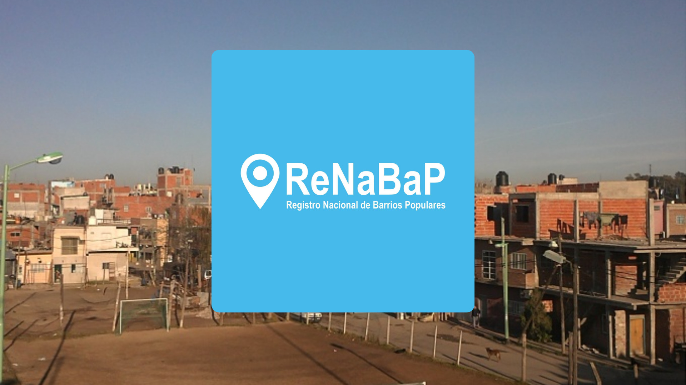
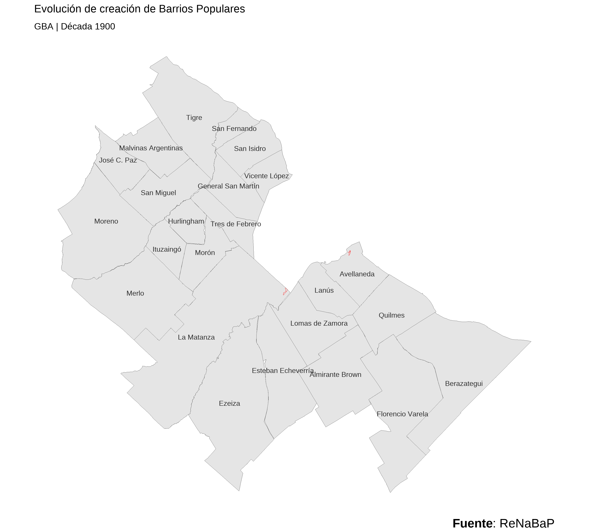

```{r setup, include=FALSE}
knitr::opts_chunk$set(echo = TRUE, message = FALSE, warning = FALSE, dpi = 150, fig.showtext=TRUE)
options(scipen = 999)

```

# Trabajo Final Ciencia de datos II: Características y Accesibilidad de Barrios Populares en Gran Buenos Aires

```{r, echo=FALSE, out.width="50%", fig.align='center'}

```

## Introducción

<div style="text-align: justify">

Este análisis forma parte de la evaluación final del módulo Ciencia de Datos II. La idea es llevar adelante un análisis exploratorio acerca de la situación de los Barrios Populares a partir del relevamiento efectuado en el [ReNaBap](https://www.argentina.gob.ar/habitat/integracion-socio-urbana/renabap).

La pregunta principal que guía este artículo consiste en describir el escenario actual en terminos evolutivos y de infraestructura de los BP considerando, además, las condiciones de integración y accesibilidad de los mismos.

A los fines de recortar espacialmente nuestro objeto, se abordará la situación de los barrios populares del Gran Buenos Aires considerando la definición empleada por el INDEC [^1] que define el área compuesta por 24 partidos sin considerar la Ciudad Autónoma de Buenos Aires. Para el agrupamiento de los partidos se puede establecer el criterio empleado por la Ley 13.473/06 [^2] excluyendo aquellas zonas y partidos que no se encuentren en la clasificación del INDEC. Estas son: (Zona del Sureste): Avellaneda, Quilmes, Berazategui, Florencio Varela y Alte. Brown. (Zona Sur): E. Echeverría, Ezeiza. (Zona Sur oeste): Lanús, Lomas de Zamora, La Matanza (Zona Noreste): Vicente López, San Isidro, San Fernando, Tigre (Zona Noroeste): Merlo y Moreno (Zona Norte Centro): San Martín, Tres de Febrero, San Miguel, Malvinas Argentinas, José C. Paz (Zona Oeste): Morón, Hurlingham, Ituzaingó.

[^1]: Disponible en: <https://www.indec.gob.ar/dbindec/folleto_gba.pdf>

[^2]: Disponible en: <https://normas.gba.gob.ar/documentos/0Z8J8IEB.html> :::

(**Nota:** Este trabajo se encuentra publicado en mi [blog](https://rpubs.com/GuilleFerchero/barrios_populares) y en mi [sitio de GitHub](https://github.com/GuilleFerchero/Big-data-e-Inteligencia-territorial--FLACSO-/tree/main/Trabajo-Final)) 

### Ideas - Objetivos:

-   Describir la situación de los BP en la región Amba en función de su evolución e infraestructura

-   Analizar las formas de crecimiento considerando los aspectos geográficos.

-   Pensar las dinámicas de accesibilidad de los BP en relación a servicios escenciales utilizando la información de OSM y vinculando la problemática con el concepto de [ciudades de 15 minutos](https://cenital.com/la-paranoia-de-los-15-minutos/)

### Fuentes

Mapa Base AMBA: Disponible en el [sitio](https://catalogo.datos.gba.gob.ar/dataset/partidos/archivo/6cd47ea4-37af-4fdb-9d38-678c1067b7e9)

Barrios Populares: Disponible en el [sitio](https://datosabiertos.desarrollosocial.gob.ar/dataset/0d022767-9390-486a-bff4-ba53b85d730e/resource/97cc7d10-ad4c-46cb-9ee4-becb402adf9f/)

Datos adicionales: Open Street Map

<div/>

### Activación de librerías

```{r libr, message=FALSE, warning=FALSE}
###################################################################################
rm(list = ls())

# Instalamos librerías de trabajo
if (!require("pacman")) install.packages("pacman")
pacman::p_load("DT",
               "lubridate",
               "tidyverse",
               "leaflet",
               "leaflet.extras",
               "sf",
               "scales",
               "ggmap",
               "osmdata",
               "showtext",
               "ggtext",
               "gganimate",
               "gifski",
               "osrm")


sf_use_s2(FALSE)
###################################################################################

#fuentes

font_add_google(family = "montserrat", "Montserrat")
#font_add_google(family = "Oswald", "Oswald")
showtext_auto()

###################################################################################
#KEY
key <- "##################" 
#register_stadiamaps(key, write = TRUE)

```

### Carga y limpieza de datos

```{r data, message=FALSE, warning=FALSE}
#Partidos PBA (#https://catalogo.datos.gba.gob.ar/dataset/partidos/archivo/6cd47ea4-37af-4fdb-9d38-678c1067b7e9)

base_map_partidos <- read_sf("data/partidos_shp/partidos.shp")%>%
                        st_transform(crs = 4326)
#Barrios CABA#######################################################################
#base_map_caba <- read_sf("https://cdn.buenosaires.gob.ar/datosabiertos/datasets/ministerio-de-educacion/barrios/barrios.geojson")%>%
                        #st_transform(crs = 4326)
#Barrios Populares - Pais###########################################################
data_bp_geo <- read_sf("data/20231205_info_publica.geojson", stringsAsFactors = TRUE)

#Definimos area de estudio
area_amba <- c('Merlo','Morón','Moreno','Quilmes','José C. Paz','Ituzaingó','Lanús',
         'La Matanza','Lomas de Zamora','Malvinas Argentinas','San Miguel',
         'San Isidro','Tigre','Vicente López','Tres de Febrero','Almirante Brown',
         'Esteban Echeverría','Florencio Varela','Ezeiza','Hurlingham',
         'General San Martín','Berazategui','Avellaneda','San Fernando')

base_map_amba_agrup <- base_map_partidos %>% 
  filter(nam %in% area_amba) %>% 
  mutate(zona = case_when(nam %in% c('Avellaneda','Quilmes','Berazategui','Florencio Varela','Almirante Brown') ~ 'Zona del Sureste',
                          nam %in% c('Esteban Echeverría','Ezeiza') ~ 'Zona del Sur',
                          nam %in% c("Lanús",'Lomas de Zamora','La Matanza') ~ 'Zona Sur Oeste',
                          nam %in% c('Vicente López','San Isidro','San Fernando', 'Tigre') ~ 'Zona Noreste',
                          nam %in% c('Merlo','Moreno') ~ 'Zona Noroeste',
                          nam %in% c('General San Martín','Tres de Febrero','San Miguel', 'Malvinas Argentinas', 'José C. Paz') ~ 'Zona Norte Centro',
                          nam %in% c('Morón','Hurlingham','Ituzaingó') ~ 'Zona Oeste',
                          )) 

data_bp_geo_amba_agrup  <- data_bp_geo %>%
  mutate(departamento = case_when(departamento == "José M. Ezeiza" ~ "Ezeiza",
                            TRUE ~ departamento )) %>% 
  filter(departamento %in% area_amba,
         provincia == "Buenos Aires") %>% 
    mutate(zona = case_when(departamento %in% c('Avellaneda','Quilmes','Berazategui','Florencio Varela','Almirante Brown') ~ 'Zona del Sureste',
                          departamento %in% c('Esteban Echeverría','Ezeiza') ~ 'Zona del Sur',
                          departamento %in% c("Lanús",'Lomas de Zamora','La Matanza') ~ 'Zona Sur Oeste',
                          departamento %in% c('Vicente López','San Isidro','San Fernando', 'Tigre') ~ 'Zona Noreste',
                          departamento %in% c('Merlo','Moreno') ~ 'Zona Noroeste',
                          departamento %in% c('General San Martín','Tres de Febrero','San Miguel', 'Malvinas Argentinas', 'José C. Paz') ~ 'Zona Norte Centro',
                          departamento %in% c('Morón','Hurlingham','Ituzaingó') ~ 'Zona Oeste',
                          ))


casos_bp <- nrow(data_bp_geo)
casos_bp_amba <- nrow(data_bp_geo_amba_agrup)

```

<div style="text-align: justify">

La base de datos populares contiene `r casos_bp` registros a nivel nacional. Si delimitamos los casos al área de estudio (24 Partidos GBA), se obtienen `r casos_bp_amba` barrios registrados.

Mediante la función summary, podemos ver las principales variables de la base:

<div/>

```{r EDA I, message=FALSE, warning=FALSE}
summary(data_bp_geo_amba_agrup)
```

Se observa que la base contiene variables que nos permiten ver las condiciones estructurales de las viviendas entre otros aspectos.

La última etapa del proceso de limpieza consiste en generar bases sin los atributos geoespaciales para generar tablas y gráficos con mayor prolijidad

```{r EDA II, message=FALSE, warning=FALSE}
data_bp <- st_drop_geometry(data_bp_geo) %>% 
  mutate("zona" = case_when( departamento %in% area_amba ~ "GBA",
                             TRUE ~ "Resto País"))
data_bp_amba <- st_drop_geometry(data_bp_geo_amba_agrup) 
```

## Expansión e Infraestructura (Análisis descriptivo)

### Evolución geográfica y estructural del surgimiento de Barrios Populares

A continuación se muestra un mapa de amba con sus barrios populares al dia de hoy.

```{r fig.height=9, fig.width=10, message=FALSE, warning=FALSE}
ggplot()+
  geom_sf(data = base_map_amba_agrup, color='black', aes(fill = zona),  size = 0.1)+
  scale_fill_manual(values=c("#072448", "#54d2d2","#ffcb00","#679186","#f8aa4b","#ff6150","#543c52"))+
  geom_sf_text(data = base_map_amba_agrup , aes(label=nam),size=4, colour='#e3e3e3')+
  geom_sf(data = data_bp_geo_amba_agrup, color = "black")+
  theme_minimal()+
  theme_void()+
  labs(
    title = "<span style = 'color:#272643;'> Barrios Populares - Gran Buenos Aires",
    caption = "<b>Fuente</b>: ReNaBaP",
    y = "",
    x = ""
  )+
  theme(
    plot.title = element_markdown(size = 20, hjust = 0.5),
    plot.caption= element_markdown(size = 15),
    legend.position = "top",
    legend.title = element_blank(),
    legend.box.margin = margin(11, 16, 6, 6)
  )+
  guides(fill=guide_legend(nrow=1,byrow=TRUE))
```

Tambien es posible mostrar la misma información en un mapa interactivo, el cual permite acceder a mayor cantidad de datos al seleccionar los barrios

```{r}
 mapa_interactivo <- leaflet() %>%
         addTiles() %>%
         #addProviderTiles(provider="CartoDB") %>% 
         addPolygons(data = data_bp_geo_amba_agrup, popup = ~ glue::glue("<b>Nombre</b>:{nombre_barrio}<br/>
                                                                    <b>Cantidad de Viviendas:</b>{cantidad_viviendas_aproximadas}<br/>
                                                                    <b>Cantidad de Familias:</b>{cantidad_familias_aproximada}<br/>
                                                                    <b>Decada de Creacion:</b>{decada_de_creacion}<br/>"), color = "#f55951")

mapa_interactivo
```

Veamos como fue la evolución del surgimiento de los barrios a nivel nacional por década:

```{r EDA III, message=FALSE, warning=FALSE}

tabla_1 <- data_bp %>% 
  mutate("decada_abr" = (substr(decada_de_creacion, 8,11))) %>%
  group_by(decada_abr) %>% 
  summarise(tot = n()) %>% 
  mutate(porcentaje = round(tot/sum(tot),4)) %>% 
  mutate(Total_Acum = cumsum(tot)) %>% 
  mutate(Porcentaje_Acum = cumsum(porcentaje))

ggplot(tabla_1, aes(x = decada_abr, y = tot))+
  geom_col(fill = "#122c91")+
  geom_text(aes(label = percent(porcentaje)), vjust = -0.25, size = 4)+
  theme_minimal()+
  labs(
    title = "<span style = 'color:#122c91;'> Evolución de Barrios Populares - Argentina",
    subtitle = "Creación de Barrios Populares por década",
    caption = "<b>Fuente</b>: ReNaBaP",
    x = "Decadas",
    y = "Barrios Populares"
  )+
  theme(
    plot.title = element_markdown(face = "bold", size = 18),
    plot.caption = element_markdown(size = 11),
  )


```

Se aprecia el primer dato relevante. De la totalidad de los barrios registrados, el 50% surgió en las décadas del 2000 y el 2010. Veamos como se dió esta situación agregando los casos de AMBA.

```{r}
tabla_2 <- data_bp %>% 
  mutate("decada_abr" = (substr(decada_de_creacion, 8,11))) %>%
  group_by(decada_abr, zona) %>% 
  summarise(tot = n()) %>% 
  mutate(porcentaje = round(tot/sum(tot),4)) %>% 
  mutate(Total_Acum = cumsum(tot)) %>% 
  mutate(Porcentaje_Acum = cumsum(porcentaje))

ggplot(tabla_2, aes(x = decada_abr, y = tot, fill = zona))+
  geom_col(position = "dodge")+
  geom_text(aes(label = percent(porcentaje)), vjust = -0.5, check_overlap = TRUE, position = position_dodge(width = .9), size = 3)+
  scale_fill_manual(values = c("#f56038","#122c91"))+
  theme_minimal()+
  labs(
    title = "<span style = 'color:#272643;'> Evolución de Barrios Populares: <span style = 'color:#122c91;'> Argentina (Sin GBA) - <span style = 'color:#f56038;'>GBA",
    subtitle = "Creación de Barrios Populares por década",
    caption = "<b>Fuente</b>: ReNaBaP",
    x = "Decadas",
    y = "Barrios Populares"
  )+
  theme(
    legend.position = "none",
    plot.title = element_markdown(face = "bold", size = 15),
    plot.caption = element_markdown(size = 12),
  )


```

```{r}


tabla_2 <- data_bp %>% 
  mutate("decada_abr" = (substr(decada_de_creacion, 8,11))) %>%
  group_by(decada_abr, zona) %>% 
  summarise(tot = n()) %>% 
  mutate(porcentaje = round(tot/sum(tot),4)) %>% 
  mutate(Porcentaje_Acum = cumsum(porcentaje)) 

tabla_2$total_acum <- ave(tabla_2$tot, tabla_2$zona, FUN=cumsum)

ggplot(tabla_2, aes(x = decada_abr, y = total_acum , group = zona , colour = zona))+
  geom_line()+
  geom_point()+
  scale_color_manual(values=c("#f56038","#122c91"))+
  #geom_text(aes(label = percent(porcentaje)), vjust = -0.25)+
  theme_minimal()+
  labs(
    title = "<span style = 'color:#122c91;'> Evolución de Barrios Populares - Argentina",
    subtitle = "Creación de Barrios Populares por década",
    caption = "<b>Fuente</b>: ReNaBaP",
    x = "Decadas",
    y = "Barrios Populares"
  )+
  theme(
    plot.title = element_markdown(face = "bold", size = 18),
    plot.caption = element_markdown(size = 12),
  )


```

Los casos de AMBA también evidencian una consolidad expansión en las décadas mencionadas. Resulta relevante indagar sobre el tipo de barrios generados en esta etapa junto con las características de esta expansión en términos geográficos.

```{r, fig.width=10, fig.height=9}

tabla_bp_dep <- data_bp_amba %>% 
  group_by(departamento) %>% 
  summarise(Total = n()) %>% 
  rename("nam" = "departamento")

base_map_amba_agrup_totalbp <- left_join(base_map_amba_agrup,tabla_bp_dep)
  
ggplot()+
  geom_sf(data = base_map_amba_agrup_totalbp, color='black', aes(fill = Total),  size = 0.1)+
  geom_sf_text(data = base_map_amba_agrup_totalbp , aes(label=nam),size=3, alpha=0.8, colour='black')+
  theme_void()+
  labs(
    title = "<span style = 'color:#272643;'> Barrios Populares - Gran Buenos Aires",
    caption = "<b>Fuente</b>: ReNaBaP",
    y = "",
    x = ""
  )+
  scale_fill_distiller(direction = 1)+
  theme(
    plot.caption= element_markdown(size = 15),
    plot.title = element_markdown(size = 20, hjust = 0.5),
  )


```

Tal cual se observa, La Matanza y Moreno parecen ser los partidos que contienen la mayor cantidad de BP. Veamos de que modo podemos analizar esto en función del tiempo transcurrido y la antigüedad. Para ello, vamos a filtrar nuestra base de BP conservando solo aquellos cuya creación corresponde a las ultimas tres décadas.

```{r, fig.width=10, fig.height=9}
ggplot()+
  geom_sf(data = base_map_amba_agrup, color='black', aes(fill = zona),  size = 0.1)+
  scale_fill_manual(values=c("#072448", "#54d2d2","#ffcb00","#679186","#f8aa4b","#ff6150","#543c52"))+
  geom_sf_text(data = base_map_amba_agrup , aes(label=nam),size=4, alpha=0.9, colour='#e3e3e3')+
  geom_sf(data = data_bp_geo_amba_agrup %>% 
            filter(decada_de_creacion %in% c("Década 2000","Década 2010","Década 2020")), color = "black")+
  theme_minimal()+
  theme_void()+
  labs(
    title = "<span style = 'color:#122c91;'> Barrios Populares - Gran Buenos Aires (2000 - 2020)",
    caption = "<b>Fuente</b>: ReNaBaP",
    y = "",
    x = ""
  )+
  theme(
    plot.title = element_markdown(size = 20, hjust = 0.5),
    plot.caption= element_markdown(size = 15),
    legend.position = "top",
    legend.title = element_blank(),
    legend.box.margin = margin(11, 16, 6, 6)
  )+
  guides(fill=guide_legend(nrow=1,byrow=TRUE))

```

Veamos como se efectuaron los surgimientos por década a partir de un mapa animado que grafique los cambios por década.

```{r map_anim, message=FALSE, warning=FALSE,fig.width=10, fig.height=9}
mapa_animado <- ggplot()+
  geom_sf(data = base_map_amba_agrup)+
  geom_sf_text(data = base_map_amba_agrup , aes(label=nam),size=3, alpha=0.8, colour='black')+
  geom_sf(data = data_bp_geo_amba_agrup,inherit.aes=FALSE, color = "red")+
  scale_fill_distiller(palette = "Spectral")+
  labs(title="Evolución de creación de Barrios Populares",
       subtitle = "GBA | {closest_state}",
    caption = "<b>Fuente</b>: ReNaBaP",
    y = "",
    x = "")+
  theme_void()+
    theme(
    plot.caption= element_markdown(size = 15)
  )+
  transition_states(decada_de_creacion,transition_length = 3, state_length = 2)

anim_save("map.gif", mapa_animado)
```



Puede apreciarse que las zonas de mayor distancia con respecto a CABA fueron en donde se generaron una mayor cantidad de BP durante los años 2000 y 2010.

```{r, fig.width=10, fig.height=9}

tabla_3 <- data_bp_amba %>% 
  mutate("decada_abr" = (substr(decada_de_creacion, 8,11))) %>%
  group_by(decada_abr, clasificacion_barrio) %>% 
  summarise(tot = n()) %>% 
  mutate(porcentaje = round(tot/sum(tot),4))


ggplot(tabla_3, aes(x = decada_abr, y = tot, fill = clasificacion_barrio))+
  geom_col(position = "fill")+
  #geom_text(aes(label = percent(porcentaje)), vjust = -0.5, check_overlap = TRUE, position = position_dodge(width = .9), size = 3)+
  scale_fill_manual(values=c("#f9b4ab", "#fdebd3","#778490","#679186"))+
  theme_minimal()+
  labs(
    title = "<span style = 'color:#272643;'> Evolución de Barrios Populares: <span style = 'color:#f56038;'>GBA",
    subtitle = "Evolución de la clasificación",
    caption = "<b>Fuente</b>: ReNaBaP",
    x = "Decadas",
    y = "Barrios Populares"
  )+
  theme(
    legend.position = "top",
    plot.title = element_markdown(face = "bold", size = 15),
    plot.caption = element_markdown(size = 12),
  )


#VER

```

Se observa que en las últimas décadas predominó el asentamiento por sobre la villa. En la próxima sección se ahondará acerca de el tipo de accesibilidad y distancias a servicios esenciales que se manifiestan en algunos de estos tipos de barrios.

## Accesibilidad e Integración - Distancias y Tiempos de viaje (Isócronas y Ruteos)

En función de los objetivos planteados, corresponde examinar la situación de los BP bajo la idea comparativa de evaluar el grado de accesibilidad que presentan los barrios de mayor antigüedad con respecto a aquellos cuya creación es más reciente. Para indagar esta cuestión vamos a tomar como referencia, en primer lugar el escenario de Villa Tranquila (Avellaneda - Decada de 1950)

En esta sección vamos a utilizar los recursos de OSM. En primer término vamos a mapear nuestra región de estudio construyendo su bbox

### Caso Villa Tranquila (Avellaneda - Decada de 1950)

```{r}

#https://ryanpeek.org/2016-10-19-animated-gif_maps_in_r/

bbox_amba <- st_bbox(base_map_amba_agrup %>% 
                       filter(nam == "Avellaneda"))
bbox_amba <- as.numeric(bbox_amba)
mapa_amba <- get_stadiamap(bbox = bbox_amba,
                           maptype = "alidade_smooth_dark",
                           zoom = 13)

```

```{r,fig.width=10, fig.height=9}
ggmap(mapa_amba)+
  geom_sf(data = data_bp_geo %>% 
            filter(departamento == "Avellaneda"),inherit.aes=FALSE)+
  theme_void()


```
Una cuestión metodológica que descubrí en el proceso es que Avellaneda presenta un caso particular dado que es un partido que incluye un barrio con el mismo nombre, con lo cual resulta fundamental aclarar esta cuestión dentro de la función getbb para obtener el polígono del partido y no del barrio. 

```{r}
#Descarga de hospitales - escuelas - transporte

polygon_avellaneda <- getbb("Partido de Avellaneda, Buenos Aires",
                            format_out = "sf_polygon")

hospitales_avellaneda <- opq(bbox_amba)
hospitales_avellaneda <- add_osm_feature(hospitales_avellaneda, key = "amenity", value = c("clinic","hospital"))
hospitales_avellaneda <- osmdata_sf(hospitales_avellaneda)
hospitales_avellaneda <- hospitales_avellaneda$osm_points

escuelas_avellaneda <- opq(bbox_amba)
escuelas_avellaneda <- add_osm_feature(escuelas_avellaneda, key = "amenity", value = c("school","university","college"))
escuelas_avellaneda <- osmdata_sf(escuelas_avellaneda)
escuelas_avellaneda <- escuelas_avellaneda$osm_points

transporte_avellaneda <- opq(bbox_amba)
transporte_avellaneda <- add_osm_feature(transporte_avellaneda, key = "public_transport", value = c("stop_position","	platform","station","stop_area"))
transporte_avellaneda <- osmdata_sf(transporte_avellaneda)
transporte_avellaneda <- transporte_avellaneda$osm_points


hospitales_avellaneda <- st_intersection(hospitales_avellaneda, polygon_avellaneda) %>% 
  mutate("tipo" = "hospitales") %>% 
  select(name, tipo, geometry) %>% 
  filter(!is.na(name))
escuelas_avellaneda <- st_intersection(escuelas_avellaneda, polygon_avellaneda)%>% 
  mutate("tipo" = "escuelas")%>% 
  select(name, tipo, geometry) %>% 
  filter(!is.na(name))
transporte_avellaneda <- st_intersection(transporte_avellaneda, polygon_avellaneda) %>% 
  mutate("tipo" = "transporte")%>% 
  select(name, tipo, geometry) %>% 
  filter(!is.na(name))

lugares_avellaneda <- rbind(hospitales_avellaneda,escuelas_avellaneda,transporte_avellaneda)

#Definición de centroide

data_bp_geo_amba_centroide <- data_bp_geo_amba_agrup %>% 
  filter(departamento == "Avellaneda",
         nombre_barrio == "Villa Tranquila") %>% 
  st_centroid()

#Definición de isocrona

isocrona_vt <- osrmIsochrone(loc = data_bp_geo_amba_centroide$geometry,
                     breaks = seq(from=0,to=20,by=5),
                     res = 35,
                     osrm.profile = "foot")

```

```{r}

leaflet(isocrona_vt) %>% 
  addTiles(group = "OSM (default)") %>%
  addProviderTiles(providers$CartoDB.Positron, group = "Positron (minimal)") %>%
  addProviderTiles(providers$CartoDB.DarkMatter, group = "DarkMatter") %>%
  addPolygons(fillColor = ~colorBin("YlOrRd", domain = isocrona_vt$isomax)(isomax),
  color = NA,
  fillOpacity = 0.5, group = "isocrona")%>%
  addPolygons(data = data_bp_geo_amba_agrup %>% 
            filter(departamento == "Avellaneda"),popup = ~ glue::glue("<b>Nombre</b>:{nombre_barrio}<br/>
                                                                    <b>Cantidad de Viviendas:</b>{cantidad_viviendas_aproximadas}<br/>
                                                                    <b>Cantidad de Familias:</b>{cantidad_familias_aproximada}<br/>
                                                                    <b>Decada de Creación:</b>{decada_de_creacion}<br/>"),group = "Barrios Populares", color = "#f55951") %>% 
  addCircleMarkers(data = data_bp_geo_amba_centroide, color = "black", group = "Villa Tranquila") %>% 
  addCircleMarkers(data = lugares_avellaneda %>% 
                          filter(tipo == "hospitales"), popup = ~ glue::glue("<b>Nombre</b>:{name}<br/>
                                                                   <b>tipo:</b>{tipo}<br/>"), group = "hospitales", color = "#001f7d") %>%
  addCircleMarkers(data = lugares_avellaneda%>% 
                          filter(tipo == "escuelas"), popup = ~ glue::glue("<b>Nombre</b>:{name}<br/>
                                                                   <b>tipo:</b>{tipo}<br/>"), group = "escuelas", color = "#58b368") %>%
  addCircleMarkers(data = lugares_avellaneda%>% 
                          filter(tipo == "transporte"), popup = ~ glue::glue("<b>Nombre</b>:{name}<br/>
                                                                   <b>tipo:</b>{tipo}<br/>"), group = "transporte", color = "#dad873") %>% 
  
    addLayersControl(
    baseGroups = c(
      "OSM (default)",
      "Positron (minimal)",
      "DarkMatter"
    ),
    overlayGroups = c("Villa Tranquila", "Barrios Populares","isocrona", "escuelas","transporte","hospitales"),
    options = layersControlOptions(collapsed = FALSE)
  )

```

dado que la descarga no aporta los nombres de los sitios, intentaremos trabajar con el catálogo de hospitales de \#<https://catalogo.datos.gba.gob.ar/dataset/establecimientos-salud/archivo/716c84ba-6ed7-490b-81f7-e3e97d746d44>

```{r}

hosp_ave_da <- read_sf("data/hospítales/Establecimientos_salud_publicos_alta_al20220721.geojson", stringsAsFactors = TRUE)
hosp_ave_da <- hosp_ave_da %>% 
  filter(nde == "AVELLANEDA")

hosp_ave_da <- st_intersection(hosp_ave_da, polygon_avellaneda)


```

```{r}

data_villa_tranquila <- data_bp_geo_amba_centroide %>% 
  select(nombre_barrio,geometry) %>% 
  mutate("nde" = "AVELLANEDA") 
data_villa_tranquila <- cbind(data_villa_tranquila, st_coordinates(data_villa_tranquila)) %>%
                      st_set_geometry(NULL) %>% 
                      rename(LON_ORIGEN=X,
                             LAT_ORIGEN=Y)
hosp <- hosp_ave_da %>% 
  rename(LON_DESTINO=long,
         LAT_DESTINO=lat) %>% 
  select(LAT_DESTINO,LON_DESTINO,fna,nde) %>% 
  left_join(data_villa_tranquila)

```

Función de ruteo:

```{r}

obtener_recorrido <- function(o_x, o_y, d_x, d_y) {
    
    ruta <- osrmRoute(src = c(o_x, o_y),
                      dst = c(d_x, d_y))
    
    #cbind(nombre_barrio = o_nombre, fna = d_nombre, ruta)
    
}


argumentos <- list(hosp$LON_ORIGEN, hosp$LAT_ORIGEN,
                  hosp$LON_DESTINO, hosp$LAT_DESTINO)

de_vt_a_hospitales <- pmap_df(argumentos, obtener_recorrido)

de_vt_a_hospitales <- de_vt_a_hospitales %>% 
  arrange(distance)

prom_dist_vt <- round(mean(de_vt_a_hospitales$distance),2)

prom_tiempo_vt <- round(mean(de_vt_a_hospitales$duration),2)

min_dist_vt <- round(min(de_vt_a_hospitales$distance),2)

min_tiempo_vt <- round(min(de_vt_a_hospitales$duration),2)


summary(de_vt_a_hospitales$distance)
summary(de_vt_a_hospitales$duration)

```
Los estadísticos nos muestran que existen 53 establecimientos cercanos a Villa Tranquila, entre los cuales la media de distancia equivale a 5 km y el mas cercano se encuentra a 0,42 km. Las duraciones promedio rondan los 7 minutos. A continuación se grafifcarán los ruteos obtenidos mediante un mapa interactivo, tomando solamente las 15 rutas más cercanas para facilitar la visualización. 


```{r}

leaflet() %>% 
  addTiles() %>% 
  #addPolygons(data = polygon_avellaneda)+
  addPolygons(data = data_bp_geo_amba_agrup %>% 
            filter(departamento == "Avellaneda"),popup = ~ glue::glue("<b>Nombre</b>:{nombre_barrio}<br/>
                                                                    <b>Cantidad de Viviendas:</b>{cantidad_viviendas_aproximadas}<br/>
                                                                    <b>Cantidad de Familias:</b>{cantidad_familias_aproximada}<br/>
                                                                    <b>Decada de Creación:</b>{decada_de_creacion}<br/>"), color = "#f55951") %>% 
  addCircleMarkers(data = data_bp_geo_amba_centroide, color = "green") %>% 
  addMarkers(data = hosp_ave_da, popup = ~ glue::glue("<b>Nombre</b>:{fna}<br/>
                                                                   <b>gna:</b>{gna}<br/>")) %>% 
  addPolylines(data = de_vt_a_hospitales %>% 
                 head(15),color = "red",
                 label = paste("Distancia:", round(de_vt_a_hospitales$distance,2), "|",
                               "Duración:", round(de_vt_a_hospitales$duration,2)))
```


### Caso Asentamiento Primavera (La Matanza - Decada de 2000)

Vamos a analizar el grado de integración y accesibilidad del Asentamiento Primavera en la localidad de La Matanza. Volvemos a realizar los procesos de descarga para esta zona. 

```{r}

#https://ryanpeek.org/2016-10-19-animated-gif_maps_in_r/

bbox_lm <- st_bbox(base_map_amba_agrup %>% 
                       filter(nam == "La Matanza"))
bbox_lm <- as.numeric(bbox_lm)
mapa_lm <- get_stadiamap(bbox = bbox_lm,
                           maptype = "alidade_smooth_dark",
                           zoom = 13)

```

```{r,fig.width=10, fig.height=9}
ggmap(mapa_lm)+
  geom_sf(data = data_bp_geo %>% 
            filter(departamento == "La Matanza"),inherit.aes=FALSE)+
  theme_void()


```

```{r}
#Descarga de hospitales - escuelas - transporte

polygon_la_matanza <- getbb("La Matanza, Buenos Aires",
                            format_out = "sf_polygon")

hospitales_la_matanza  <- opq(bbox_lm)
hospitales_la_matanza  <- add_osm_feature(hospitales_la_matanza, key = "amenity", value = c("clinic","hospital"))
hospitales_la_matanza  <- osmdata_sf(hospitales_la_matanza)
hospitales_la_matanza  <- hospitales_la_matanza$osm_points

escuelas_la_matanza <- opq(bbox_lm)
escuelas_la_matanza <- add_osm_feature(escuelas_la_matanza, key = "amenity", value = c("school","university","college"))
escuelas_la_matanza <- osmdata_sf(escuelas_la_matanza)
escuelas_la_matanza <- escuelas_la_matanza$osm_points

transporte_la_matanza <- opq(bbox_lm)
transporte_la_matanza <- add_osm_feature(transporte_la_matanza, key = "public_transport", value = c("stop_position","	platform","station","stop_area"))
transporte_la_matanza <- osmdata_sf(transporte_la_matanza)
transporte_la_matanza <- transporte_la_matanza$osm_points


hospitales_la_matanza <- st_intersection(hospitales_la_matanza, polygon_la_matanza) %>% 
  mutate("tipo" = "hospitales") %>% 
  select(name, tipo, geometry) %>% 
  filter(!is.na(name))
escuelas_la_matanza <- st_intersection(escuelas_la_matanza, polygon_la_matanza)%>% 
  mutate("tipo" = "escuelas")%>% 
  select(name, tipo, geometry) %>% 
  filter(!is.na(name))
transporte_la_matanza <- st_intersection(transporte_la_matanza, polygon_la_matanza) %>% 
  mutate("tipo" = "transporte")%>% 
  select(name, tipo, geometry) %>% 
  filter(!is.na(name))

lugares_la_matanza <- rbind(hospitales_la_matanza,escuelas_la_matanza,transporte_la_matanza)

#Definición de centroide

data_bp_geo_lm_centroide <- data_bp_geo_amba_agrup %>% 
  filter(departamento == "La Matanza",
         nombre_barrio == "Primavera") %>% 
  st_centroid()

#Definición de isocrona

isocrona_lm <- osrmIsochrone(loc = data_bp_geo_lm_centroide$geometry,
                     breaks = seq(from=0,to=20,by=5),
                     res = 35,
                     osrm.profile = "foot")

```

```{r}

leaflet(isocrona_lm) %>% 
  addTiles(group = "OSM (default)") %>%
  addProviderTiles(providers$CartoDB.Positron, group = "Positron (minimal)") %>%
  addProviderTiles(providers$CartoDB.DarkMatter, group = "DarkMatter") %>%
  addPolygons(fillColor = ~colorBin("Oranges", domain = isocrona_vt$isomax)(isomax),
  color = NA,
  fillOpacity = 0.5, group = "isocrona")%>%
  addPolygons(data = data_bp_geo_amba_agrup %>% 
            filter(departamento == "La Matanza"),popup = ~ glue::glue("<b>Nombre</b>:{nombre_barrio}<br/>
                                                                    <b>Cantidad de Viviendas:</b>{cantidad_viviendas_aproximadas}<br/>
                                                                    <b>Cantidad de Familias:</b>{cantidad_familias_aproximada}<br/>
                                                                    <b>Decada de Creación:</b>{decada_de_creacion}<br/>"), group = "Barrios Populares",color = "#f55951") %>% 
  addCircleMarkers(data = data_bp_geo_lm_centroide, color = "black", group = "Asentamiento Primavera") %>% 
  addCircleMarkers(data = lugares_la_matanza %>% 
                          filter(tipo == "hospitales"), popup = ~ glue::glue("<b>Nombre</b>:{name}<br/>
                                                                   <b>tipo:</b>{tipo}<br/>"), group = "hospitales", color = "#001f7d") %>%
  addCircleMarkers(data = lugares_la_matanza%>% 
                          filter(tipo == "escuelas"), popup = ~ glue::glue("<b>Nombre</b>:{name}<br/>
                                                                   <b>tipo:</b>{tipo}<br/>"), group = "escuelas", color = "#58b368") %>%
  addCircleMarkers(data = lugares_la_matanza%>% 
                          filter(tipo == "transporte"), popup = ~ glue::glue("<b>Nombre</b>:{name}<br/>
                                                                   <b>tipo:</b>{tipo}<br/>"), group = "transporte", color = "#dad873") %>% 
  
    addLayersControl(
    baseGroups = c(
      "OSM (default)",
      "Positron (minimal)",
      "DarkMatter"
    ),
    overlayGroups = c("Asentamiento Primavera","Barrios Populares", "isocrona","escuelas","transporte","hospitales"),
    options = layersControlOptions(collapsed = FALSE)
  )

```


```{r}

hosp_ave_lm <- read_sf("data/hospítales/Establecimientos_salud_publicos_alta_al20220721.geojson", stringsAsFactors = TRUE)
hosp_ave_lm <- hosp_ave_lm %>% 
  filter(nde == "LA MATANZA")

hosp_ave_lm <- st_intersection(hosp_ave_lm, polygon_la_matanza)


```

```{r}

data_asen_primavera <- data_bp_geo_lm_centroide %>% 
  select(nombre_barrio,geometry) %>% 
  mutate("nde" = "LA MATANZA") 
data_asen_primavera <- cbind(data_asen_primavera , st_coordinates(data_asen_primavera)) %>%
                      st_set_geometry(NULL) %>% 
                      rename(LON_ORIGEN=X,
                             LAT_ORIGEN=Y)

hosp_lm <- hosp_ave_lm %>% 
  rename(LON_DESTINO=long,
         LAT_DESTINO=lat) %>% 
  select(LAT_DESTINO,LON_DESTINO,fna,nde) %>% 
  left_join(data_asen_primavera)

```
```{r}

obtener_recorrido <- function(o_x, o_y, d_x, d_y) {
    
    ruta <- osrmRoute(src = c(o_x, o_y),
                      dst = c(d_x, d_y))
    
    #cbind(nombre_barrio = o_nombre, fna = d_nombre, ruta)
    
}


argumentos <- list(hosp_lm$LON_ORIGEN, hosp_lm$LAT_ORIGEN,
                  hosp_lm$LON_DESTINO, hosp_lm$LAT_DESTINO)

de_lm_a_hospitales <- pmap_df(argumentos, obtener_recorrido)

de_lm_a_hospitales <- de_lm_a_hospitales %>% 
  arrange(distance)

summary(de_lm_a_hospitales$distance)
summary(de_lm_a_hospitales$duration)
```

Los estadísticos nos muestran, en este caso que existen 88 establecimientos cercanos al Asentamiento, entre los cuales la media de distancia equivale a 11 km y el mas cercano se encuentra a 1,46 km. Las duraciones promedio rondan los 16 minutos duplicando los valores obtenidos en Villa Tranquila. A continuación se graficarán los ruteos obtenidos mediante un mapa interactivo, tomando solamente las 15 rutas más cercanas para facilitar la visualización. 


```{r}

leaflet() %>% 
  addTiles() %>% 
  addPolygons(data = data_bp_geo_amba_agrup %>% 
            filter(departamento == "La Matanza"),popup = ~ glue::glue("<b>Nombre</b>:{nombre_barrio}<br/>
                                                                    <b>Cantidad de Viviendas:</b>{cantidad_viviendas_aproximadas}<br/>
                                                                    <b>Cantidad de Familias:</b>{cantidad_familias_aproximada}<br/>
                                                                    <b>Decada de Creación:</b>{decada_de_creacion}<br/>"), color = "#f55951") %>% 
  addCircleMarkers(data = data_bp_geo_lm_centroide, color = "green") %>% 
  addMarkers(data = hosp_ave_lm, popup = ~ glue::glue("<b>Nombre</b>:{fna}<br/>
                                                                   <b>gna:</b>{gna}<br/>")) %>% 
  addPolylines(data = de_lm_a_hospitales %>% 
                 head(15),color = "red",
                 label = paste("Distancia:", round(de_lm_a_hospitales$distance,2), "|",
                               "Duración:", round(de_lm_a_hospitales$duration,2)))
```


## Conclusiones

<div style="text-align: justify">

A través de las herramientas de georeferenciación comprendidas en la materia, se analizó la situación de los Barrios Populares del Gran Buenos Aires a partir de sus clasificaciones y antigüedad de los mismos. En base a ello, se tomaron dos casos con el objeto de estudiar su grado de accesibilidad a servicios de salud, transporte y educación. Las técnicas utilizadas consistieron en descargar información de la API de OSM Y de datos abiertos de PBA para complementar lo que no se encuentre en el primero. Con estos datos, se obtuvo un isócrona para evaluar de manera visual en un mapa interactivo, las formas de integración de los barrios como un posible insumo para pensar estas problemáticas bajo la premisa de "ciudades de 15 minutos". 
En este orden de ideas, pudo verse también que en el caso de Villa Tranquila, los tiempos y las distancias de los ruteos hacia servicios sanitarios marcaron cifras considerablemente menores que en el caso del Asentamiento Primavera de La Matanza. 

<div/>

## Futuras Ideas

Construir una shiny app con toda la información recabada para facilitar las visualizaciones

Construir una función que mapee y rutee tomando como insumo el nombre del barrio y el partido.

