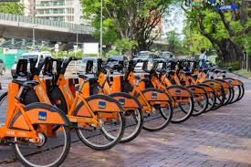

## Trabajo Final Ciencia de Datos II

### Introducción

::: {align="justify"}
Este análisis forma parte de la evaluación final del módulo Ciencia de Datos II. La idea es llevar adelante un análisis exploratorio acerca del Programa Ecobici durante el año **2023** a modeo de continuacuón del trabajo presentado en la materia Ciencia de Datos I, disponible en mi [blog](https://rpubs.com/GuilleFerchero/Ecobici_Parte_I).

La pregunta principal que guía este artículo consiste en pensar el funcionamiento del programa en función de su **oferta** como de su **demanda** utilizando las técnicas vinculadas al análisis geográfico analizadas en la cursada.
:::

(**Nota:** Este trabajo se encuentra publicado en y en mi [sitio de GitHub](https://github.com/GuilleFerchero/Big-data-e-Inteligencia-territorial--FLACSO-/tree/main/Trabajo-Final)) #ACTUALZAR AL FINALIZAR

```{r, echo=FALSE, out.width="50%", fig.align='center'}

```

### Preguntas/Objetivos:

-   

    A)  Indagar acerca de los centros y periferias en relación a la cobertura territorial en base a la **oferta** del programa (Estaciones) así como también su **demanda** (Recorridos/Usuarios)

-   

    B)  Evaluar la densidad de recorridos (puntos origen - puntos destino) en función de los horarios y del día (habil - fin de semana) para comprender la dinámica del uso como medio de transporte ya sea hacia lugares de trabajo / unviersidades, como de recreación (EST ORIGEN = EST DESTINO).

-   

    C)  Analizar la duración de recorridos en minutos y las distancias abordadas con el objeto de utilizar como insumo para abordar la temática de ciudad de 15 minutos (isocronas).

-   

    D)  Evaluar las tipologías que adquiere la movilidad urbana en el programa ECOBICI tomando en consideración el género y edad de usuarios, asi como tambien los destinos más comunes.

-   

    E)  Indagar acerca de la influencia climática en la demanda del programa.

### Fuentes

#### Ecobici:

Recorridos 2023

Estaciones

Usuarios 2019-2023

Los datos se encuentran disponibles en el [sitio](https://data.buenosaires.gob.ar/dataset/bicicletas-publicas).

#### Clima:

Dataset con información de clima solicitada al SMN Dataset mediante funcion de scraping del sitio SMN (Explicado en mi [blog](https://rpubs.com/GuilleFerchero/Scrap_smn))

### Carga de librerías y lectura de datos

::: {align="justify"}
El primer paso es limpiar ambiente, cargar librerías de trabajo y los datasets correspondientes. Tambien en esta sección se efectuarán las uniones entre datasets con el objeto generar toda la información posible.
:::

#### Librerías

```{r librerias, message=FALSE, warning=FALSE}

rm(list = ls())
options(scipen = 999)

###################################################################################
# Instalamos librerías de trabajo
if (!require("pacman")) install.packages("pacman")
pacman::p_load("DT",
               "lubridate",
               "tidyverse",
               "leaflet",
               "sf",
               "scales",
               "ggmap",
               "osmdata",
               "showtext",
               "ggtext")

###################################################################################

```

#### Base Usuarios

```{r usuarios, message=FALSE, warning=FALSE}

#Función para levantar, limpiar y compilar diferentes bases de usuarios por año

get_usuarios <- function(añoini,añofin){
  list <- seq(añoini,añofin)
  datausuarios <- data.frame()
  
  for (i in list) {
    link <- glue::glue("data/usuarios_ecobici_{i}.csv")
    usuarios <- read.csv(link, encoding = "UTF-8")
    usuarios <- usuarios %>%
    mutate("Genero" = case_when( genero_usuario == "MALE" ~ "Masculino",
                               genero_usuario == "FEMALE" ~ "Femenino",
                               TRUE ~ "Otro"),
         "Fecha" = ymd(fecha_alta),
         "Mes" = month(Fecha, label = TRUE),
         "Dia" = wday(Fecha,label = TRUE, abbr = FALSE),
         "Hora" = hms(hora_alta),
         "Edad" = as.numeric(as.character(edad_usuario)),
         "Año" = year(fecha_alta),
         "EdadRec" = case_when(Edad >= 0 & Edad < 15 ~ "Menores de 15",
                               Edad >= 15 & Edad < 20 ~ "de 15 hasta 20",
                            Edad >= 20 & Edad < 25 ~ "de 20 hasta 25",
                            Edad >= 25 & Edad < 30 ~ "de 25 hasta 30",
                            Edad >= 30 & Edad < 35 ~ "de 30 hasta 35",
                            Edad >= 35 & Edad < 40 ~ "de 35 hasta 40",
                            Edad >= 40 & Edad < 45 ~ "de 40 hasta 45",
                            Edad >= 45 & Edad < 50 ~ "de 45 hasta 50",
                            Edad >= 50 & Edad < 55 ~ "de 50 hasta 55",
                            TRUE ~ "Mayores de 55")) %>% 
      select(ID_usuario, Genero, Edad, Año, EdadRec)
    
    datausuarios <- rbind(datausuarios,usuarios)
    
  }
  return(datausuarios)
}

data_usuarios <- get_usuarios(2019,2023)
```

#### Base Recorridos

```{r recorridos, message=FALSE, warning=FALSE}

# leemos archivo de trabajo (RECORRIDOS)

link<- ("data/recorridos-realizados-2023.zip")
temp <- tempfile(link)
data <- read.csv(unz(link, "trips_2023.csv"), encoding = "UTF-8")
unlink(temp)

# limpieza duración recorrido

data$duracion_recorrido <- sub(",", "", data$duracion_recorrido, fixed = TRUE)

datareco <- data %>%
  mutate("Duración_recorrido" = as.numeric(as.character(data$duracion_recorrido)),
         "Fecha_origen" = ymd_hms(data$fecha_origen_recorrido),
         "Fecha_destino" = ymd_hms(data$fecha_destino_recorrido),
         "Duración_real" = Fecha_destino - Fecha_origen,
         "Día_label_origen" = wday(Fecha_origen, label = TRUE, abbr = FALSE),
         "Día_origen" = as.Date(data$fecha_origen_recorrido),
         "Mes_origen" = as.numeric(format(Día_origen,"%m")))

rm(data)

#######SELECCIONAR LAS VARIABLES QUE VOY A USAR

data_recorridos <- datareco %>% 
  select(Id_recorrido,
         id_usuario,
         nombre_estacion_origen,
         nombre_estacion_destino,
         Fecha_origen,
         Fecha_destino,
         duracion_recorrido,
         Duración_real,
         Día_origen,
         Día_label_origen,
         género,
         Mes_origen,
         long_estacion_origen,
         lat_estacion_origen,
         long_estacion_destino,
         lat_estacion_destino)

rm(datareco)


#Extraer la actividad de un dia:

fechalim1 <- as.Date("2023-07-07")
fechalim2 <- as.Date("2023-07-08")

dataday <- data_recorridos %>% 
  filter(Fecha_origen  > fechalim1 & Fecha_origen  < fechalim2)


```

#### Base Estaciones

```{r estaciones, message=FALSE, warning=FALSE}

##(PRUEBA DESCARGA ESTACIONES)
linkest <- "https://cdn.buenosaires.gob.ar/datosabiertos/datasets/transporte-y-obras-publicas/estaciones-bicicletas-publicas/nuevas-estaciones-bicicletas-publicas.geojson"

dataest <- st_read(linkest)

##(DESCARGA MAPA BARRIOS CABA)

#barrios <- st_read('https://bitsandbricks.github.io/data/CABA_barrios.geojson')


data_estaciones <- dataest %>%  
  mutate("Región" = case_when(COMUNA %in% c("COMUNA 12","COMUNA 13","COMUNA 14","COMUNA 2") ~ "Norte",
                              COMUNA %in% c("COMUNA 5","COMUNA 6","COMUNA 7","COMUNA 10","COMUNA 11","COMUNA 15","COMUNA 1","COMUNA 3") ~ "Centro",
                              COMUNA %in% c("COMUNA 8","COMUNA 4","COMUNA 9") ~ "Sur",
                              COMUNA == "" ~ "Sin Informar"))

rm(dataest)
rm(estaciones)

```

#### Clima

```{r clima ,message=FALSE, warning=FALSE}

clima <- read.csv("data/clima_aeroparque_2023.csv", sep = ";")

clima <- clima %>%  
  mutate(Fecha = dmy(Fecha))
```

#### Uniones

```{r Uniones I, message=FALSE, warning=FALSE}

######################################### data_estaciones con cantidad de recorridos en 2023 ######################################################

data_recorridos <- data_recorridos %>% 
  mutate(Est_origen = as.numeric(substr(nombre_estacion_origen,1,3)),
         Est_destino = as.numeric(substr(nombre_estacion_destino,1,3)))

tabla_est_origen <- data_recorridos %>% 
  group_by(Est_origen) %>% 
  summarise(recorridos = n()) %>% 
  rename("NUMERO" = Est_origen)

data_estaciones <- left_join(data_estaciones,tabla_est_origen)


######################################### data_usuarios con cantidad de recorridos en 2023 ######################################################

data_recorridos <- data_recorridos %>% 
  mutate(id_usuario_limpio = as.numeric(str_replace(id_usuario,"BAEcobici","")))

tabla_usuarios_reco <- data_recorridos %>% 
  group_by(id_usuario_limpio) %>% 
  summarise(recorridos = n()) %>% 
  rename("ID_usuario" = id_usuario_limpio)

data_usuarios <- left_join(data_usuarios,tabla_usuarios_reco)

 
######################################### data_recorridos con info de género,Edad, año de alta ######################################################

#BASE RECORRIDOS CON INFO DE EDAD Y GENERO (join con usuarios 2020-2023)


tabla_usuarios_info <- data_usuarios %>% 
  select(ID_usuario,Genero,Edad,EdadRec,Año) %>% 
  rename("id_usuario_limpio" = ID_usuario)

data_recorridos <- left_join(data_recorridos,tabla_usuarios_info)

#controlo cuantos quedan afuera

# #casos_sin_na <- nrow(data_recorridos %>% 
#        filter(!is.na(Edad))) 
# 
# #casos_na <- nrow(data_recorridos %>% 
#        filter(is.na(Edad))) 

# data_recorridos<- data_recorridos %>% 
#   filter(!is.na(Edad))

######################################### data_recorridos con info de lluvias ####################################################################


precip <- clima %>% 
  select(Fecha,Precip) %>% 
  rename("Día_origen" = Fecha) %>% 
  mutate(precip_rec = case_when(Precip > 1 ~ "Lluvia",
                                TRUE ~ "No Lluvia")) %>% 
  select(Día_origen, precip_rec)

data_recorridos<- left_join(data_recorridos,precip)


```

### Usuarios y recorridos

Ya finalizado el proceso de limpieza y uniones, podemos proceder a explorar algunas de las características de los recorridos en 2023

```{r graf1, message=FALSE, warning=FALSE}
tabla_mensual_reco <- data_recorridos%>% 
  group_by(Mes_origen,Genero,precip_rec) %>% 
  summarise(total = n()) 

ggplot(tabla_mensual_reco, aes(x = Mes_origen, y = total, fill = Genero))+
  geom_col(position =  "dodge")+
  scale_x_continuous(breaks = c(seq(1,12, by = 1)))+
  theme_minimal()

```


ANTIGUEDAD DE USUARIOS (VER SI HAGO GEOM COL O SECTORES)

GEOM_COL RECORRIDOS POR COMUNA / BARRIO (COMO ANTESALA DE MATRIZ ORIGEN DESTINO Y MAPA)

MATRIZ ORIGEN DESTINO

RECORRIDOS MAS REALIZADOS

MAPA ORIGEN VERDE DESTINO ROJO POR RANGO HORARIO (ANIMADO)

MAPA ORIGEN EN VERDE Y DESTINO EN ROJO POR DIA HABIL VS FINDE LLUVIA VS NO LLUVIA

PROMEDIO DE VIAJES DIARIOS POR MES 

VIAJES SEGÚN CLIMA

RECREACIÓN VS MOVILIDAD LABORAL

######################

OFERTA:

MAPA DE ESTACIONES INTERACTIVO CON CANTIDAD DE RECORRIDOS, ANCLAJES Y HORA PICO

DENSIDAD DE ESTACIONES POR BARRIO

DISTANCIA CON UNIVERSIDADES Y PARQUES (INFO DE OSM O DESCARGA DE DATA ABIERTA)

ISOCRONAS DE ESTACIONES CON RESPECTO AL CENTRO


